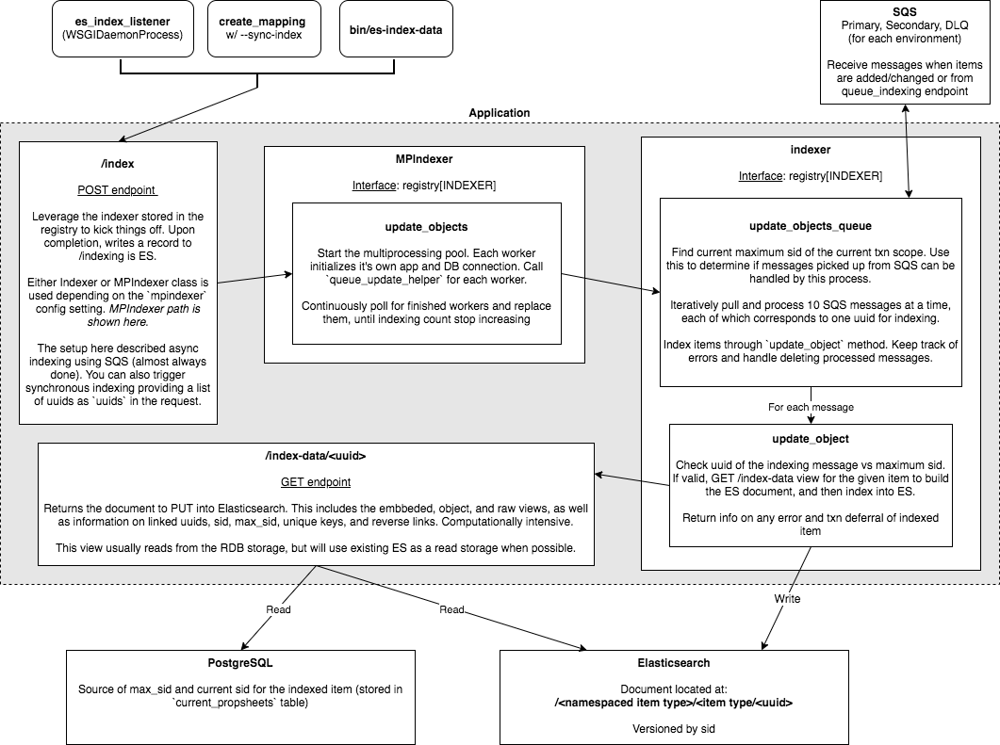

Elasticsearch Indexing
======================

**Work in progress!**

Indexing is the process of building a complete document that contains multiple views of an item, then putting that document into Elasticsearch (ES). This is done whenever an item is created or changed, and acts as one of the backbones of Snovault, allowing searching of data and quick reading of complex views for items that are "cached" by using ES as a right storage.

Figure 1: Diagram of the indexing process.

Code
-----------------
* `indexer.py <https://github.com/4dn-dcic/snovault/blob/master/src/snovault/elasticsearch/indexer.py>`_: index endpoint and initialization, Indexer class
* `mpindexer.py <https://github.com/4dn-dcic/snovault/blob/master/src/snovault/elasticsearch/mpindexer.py>`_: MPIndexer class and helper functions
* `indexer_queue.py <https://github.com/4dn-dcic/snovault/blob/master/src/snovault/elasticsearch/indexer_queue.py>`_: QueueManager and endpoints for queueing and checking indexing
* `indexing_views.py <https://github.com/4dn-dcic/snovault/blob/master/src/snovault/indexing_views.py>`_: index-data view and some other related endpoints
