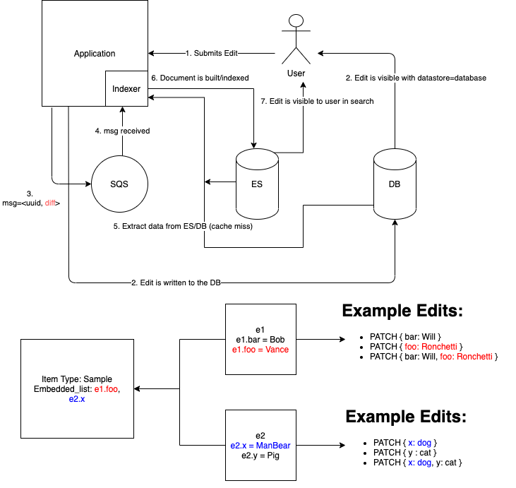

Dependecies/Invalidation
===========================

Quick reference of important files (all under src/snovault/)
------------------------------------------------------------

* indexing_views.py - contains the function that builds the object model and other information that is actually indexed. This view is in charge of generating invalidation information
* resource_views.py - contains functions for all commonly-used views, including those used in indexing_views
* embed.py - key functions used in indexing_views.py and resource_views.py
* utils.py - contains functions used in the selective embedding process (used for @@embedded view)
* resources.py - contains class definitions for the basic items in Snovault and controls adding linked and rev_linked items
* elasticsearch/indexer.py - coordinates the whole indexing/invalidation process =
* elasticsearch/indexer_utils.py - holds function used to run invalidation

Keeping elasticsearch in sync
-----------------------------

The /_indexer wsgi app (es_index_listener.py) drives the incremental indexing process. Previously in the ENCODE setup, the listener was driven by database transactions. We have moved this to a queue-based setup that does not operate on DB snapshot. At a fixed, short time interval (at time of writing: 3 seconds), the index listener calls the /index view (indexer.py) which works out what needs to be reindexed. The actual reindexing happens in parallel in multiprocessing subprocesses (mpindexer.py.)

Keeping indexing on track requires a couple components:
1. keeping track of what needs to be invalidated
2. triggering invalidation of "secondary" items in response to a "primary" item getting edited/created

Keeping track of what needs to be invalidated
---------------------------------------------

When rendering the view of an item to be indexed (@@index-data, see src/snovault/indexing_views.py), we record the set of uuids traversed when building the item. This is the _linked_uuids, which is stored as an reified attribute on the request used to build the item. These are the main source of information of what needs to be invalidated when items are updated. Whenever an item is changed, a search is performed to find all items that contain the changed item in their linked_uuids; these items are also reindexed. The function responsible for this is `find_uuids_for_indexing` in src/snovault/elasticsearch/indexer_utils.py.

Items are added to the set of request._linked_uuids in the `item_with_links` function in src/snovault/resources.py. This is the function used to control the _linked_uuids because it is closely tied with the @@object view of an item (defined in resource_views.py). The embedding process traverses the `embedded_list` of an object and uses the @@object view to build the total embedded object by iteratively visiting all its component objects. See the `embedding-and-indexing.rst` document for more information.

Reverse links (rev_links) must also be kept track of in the invalidation process. In our system, we represent rev_links as linkTos; the ENCODE concept of a linkFrom has been removed. rev_links are added to a request much the same as items are added to _linked_uuids. See the get_rev_links function in src/snovault/resources.py. This function keeps track of information of where the rev_link originates from and what item it targets, which is important information because many rev links could be visited in the process of building an embedded item.

Both _linked_uuids and rev_links are only kept track of if we are indexing. This is done by setting request._indexing_view to True in indexing_views.py. The information about the linked uuids and uuids that reverse link to an item are stored in the Elasticsearch document for the item in the `linked_uuids` and `uuids_that_rev_link_to_me` fields, respectively.

Finding items to invalidate
---------------------------

This has already been somewhat covered, but it's worth reiterating. Whenever an item is indexed, the `find_uuids_for_indexing` function is run to find all items in Elasticsearch that contain the indexed item in their linked_uuids. In addition to this, any items added from the `uuids_rev_linked_to_me` list generated from the @@index-data view are also invalidated, since new reverse links may have been created and those items need to be updated as well. All of these items are added to the secondary queue after a primary item has been indexed.

Total Reindexing
----------------

Cases can arise where a total reindexing needs to be triggered. This should be done by using `bin/create-mapping`, which executes code in create_mapping.py. The point of this code is primarily to build the mappings needed to make the indices in Elasticsearch. Secondarily, create-mapping also takes care of queueing objects for indexing. Check out the code in that file for more information. A total re-creation of Elasticsearch indices followed by reindexing can be triggered using:

`bin/create-mapping production.ini --app-name app`
NOTE: use `development.ini` locally

Purging items
-------------

There is another spot `find_uuids_for_indexing` is used, and that is to find all linked items when attempting to "purge" an item (fully remove from postgresql and Elasticsearch). Before removing an item, it is crucial to ensure that all links to that item have been removed, which is why this function is used.

Invalidation Scope
-------------------------

Previously, `find_uuids_for_indexing` would take the uuids from _linked_uuids as is. Now, if given a diff (passed from SQS on edit) the uuids returned will be pruned to determine whether or not they actually need to be invalidated. The indexer does this by examining the diff received from SQS and the embedded list of all invalidated item types. If it detects the diff modified something that is embedded in the invalidated item type, all uuids of this type are invalidated. If not, those uuids are not queued for reindexing since the edit does not change the embedded view of the item. The followind diagram serves as a visual aid.

Note that the above behavior is ONLY activate upon receiving a diff, which is computed only on item edits. Upon item creation/deletion the process remains the same, since there is no diff. It is also very important to note that any additional fields used in calculated properties are embedded as well. If not, then a field could be modified that would affect an embedded field but such edit would be invisible because we did not know the field was used.

