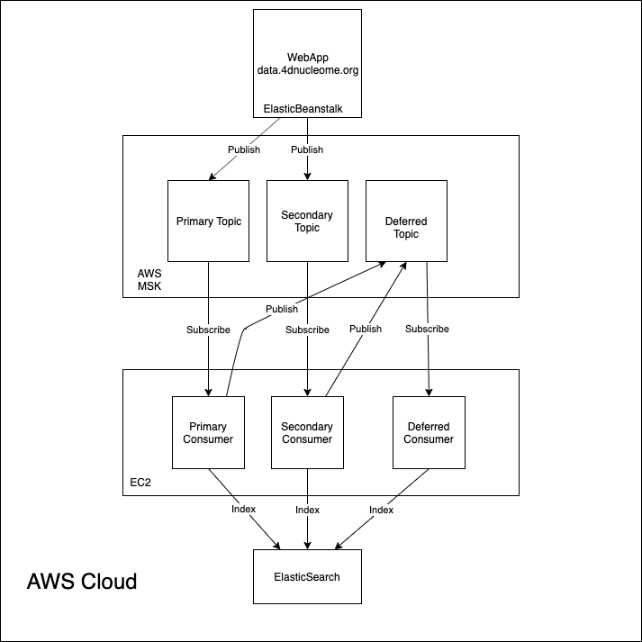

===================
Kafka Indexer Queue
===================

Overview
^^^^^^^^

This document describes a potential Apache Kafka architecture for managing Elasticsearch indexing. On the web application, when an item is uploaded/edited it must be indexed into Elasticsearch in order to show up in searches. It is not important that this search is immediately available - some delay is acceptable but it must eventually be processed exactly once.

The Kafka cluster should be configured in the following way.
- We define 3 topics: primary, secondary and deferred.
- We augment the current Indexer setup to post indexing messages to the KafkaCluster. To do this we implement a Kafka Producer API in ``indexer_queue.py`` to replace the current ``QueueManager`` class. The idea is that the main application implements the Producer API and we split the current indexer that actually processes the messages into a separate, individually scalable application that implements the Kafka Consumer API.
- We develop a search API specifically for the purpose of invalidation to be used by the Consumer API.

Producer API
^^^^^^^^^^^^

There are 2 scenarios of concern with respect to the web application, which from this point on will be referred to as the producer. Either an item to be indexed currently exists in Elasticsearch or it does not. In the latter case indexing is relatively simple as the invalidation scope is very small (if anything). In this case the producer would publish an indexing message to Kafka under the 'primary' topic. A new item should not invalidate any other so nothing is published to the secondary topic.

In the second case it is likely that some form of invalidation will take place. In this case the producer will publish an indexing message under the 'primary' topic for the modified item and a series of messages containing the uuid of each  invalidated item to the secondary topic. Since only the uuids are provided, deduplication is done automatically.

The indexer application will also implement a producer API, but is not strictly speaking the same producer as what will exist on the web application. The only scenario where the indexer will need to publish messages is when indexing an item fails, in which case the offending item uuid is published to the deferred topic.

Consumer API
^^^^^^^^^^^^

The indexer application implements the consumer API and from this point on will be referred to as the consumer. We define a set of daemon processes as the index with three different purposes.
- First, one process consumes messages from the primary topic and indexes them into Elasticsearch
- Second, one process consumes messages from the secondary topic and indexes them (if necessary) into Elasticsearch.
- Third, one process consumes messages from the deferred topic and either collecting the offending uuids for reporting or attempt to re-index.

Diagram
^^^^^^^

