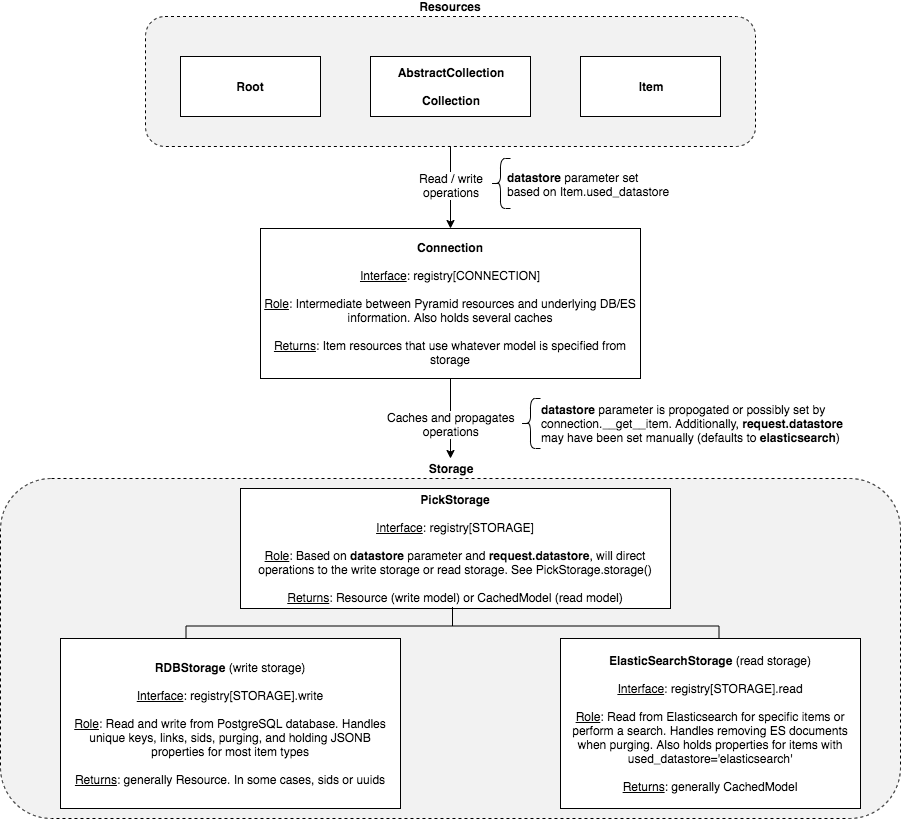

Storage Overview
=======================================

Figure 1: Overview of the storage classes. Emphasis is given to how read and write operations are directed to either the PostgreSQL or Elasticsearch storage interfaces.

Resources
-----------------
The base Snovault resources are outlined in `another document <https://snovault.readthedocs.io/en/latest/resources.html>`_. Snovault resources use the Connection class as an interface for reading and writing from PostgreSQL and Elasticsearch. The Root and AbstractCollection classes interface with Connection (see below) for traversal purposes when getting specific items. The base Item class uses Connection in its create and update methods to write to the underlying DB tables.

In the context of storage, one important AbstractCollection attribute is ``properties_datastore``. It can be set to determine which database is used to store properties of the item (i.e. PostgreSQL or Elasticsearch). This attribute is passed directly to some Connection methods through the ``datastore`` parameter.

Connection
-----------------
The Connection class is defined in `storage.py <https://github.com/4dn-dcic/snovault/blob/master/src/snovault/storage.py>`_ and is used as an interface between other higher-level classes and the underlying Storage classes, which are used to access PostgreSQL and Elasticsearch. Using the ``includeme`` function, the Connection is added to the Pyramid registry and is accessed using ``registry[CONNECTION]`` after importing CONNECTION from `interfaces.py <https://github.com/4dn-dcic/snovault/blob/master/src/snovault/interfaces.py>`_.

In general, Connection is responsible for getting the underlying DB model and returning an Item instance using that model. Additionally, the class defines a number of caches that are used increase the speed of item/view retrieval.

The methods on Storage closely resemble those defined on PickStorage, since it is used as a wrapper for the latter class. Many storage methods will have a ``datastore`` parameter that can be used to force using either the read (Elasticsearch) or write (PostgreSQL) storage classes.

Here are some details on the caches, which are all stored as attributes on Connection:
- item_cache: used to cache Items by uuid
- unique_key_cache: used to cache uuids by unique key/value. Keys for this cache are tuples in the form: (unique_key, value)
- embed_cache: stores the result of resource views by path. Leveraged in `embed.py <https://github.com/4dn-dcic/snovault/blob/master/src/snovault/embed.py>`_.

PickStorage
-----------------
The first of the storage-related classes, PickStorage is defined in `storage.py <https://github.com/4dn-dcic/snovault/blob/master/src/snovault/storage.py>`_. It routes requests for database models to either RDBStorage or ElasticSearchStorage using the ``storage`` method depending on a few different factors, listed below:

- request.datastore: this can be set as a query parameter for HEAD and GET requests, e.g. ``?datastore=database``. Valid values are "database" and "elasticsearch". Set by default to "elasticsearch" for most GET requests
- datastore parameter: some PickStorage methods take the datastore parameter, which can be used to force one storage or another. Valid values are "database" and "elasticsearch"
- Missing storage: if the read storage (Elasticsearch) is missing, will automatically use the write storage

Some PickStorage methods used read/write storage in fixed ways. Examples of these are ``create``, ``purge_uuid``, and ``get_sids_by_uuids``.

In general, PickStorage is responsible for returning a database model for a resource. The model itself will vary based on which underlying storage class is used. PickStorage is stored in the Pyramid registry and is accessed using ``registry[STORAGE]`` after importing STORAGE from interfaces.py. The ``register_storage`` function in storage.py is used to initialize the PickStorage and underlying write storage, as well attachment storage in ``registry[BLOBS]``.

RDBStorage
-----------------
Also referred to as "write" storage, this is the storage class that interfaces with PostgreSQL. Requests are usually routed to this object through PickStorage and return an instance of the Resource class, which is the model for "database" resources. Both RDBStorage, Resource, and all related SQLAlchemy ORM classes are defined in `storage.py <https://github.com/4dn-dcic/snovault/blob/master/src/snovault/storage.py>`_.

PostgreSQL storage is responsible for a lot of the Item-level features, such as unique keys (through the Key class) and auto-incrementing sids (as well as maximum sids). It is closely linked with the SQLAlchemy ``scoped_session`` that is set in ``registry[DBSESSION]`` in the ``configure_dbsession`` function of `app.py <https://github.com/4dn-dcic/snovault/blob/master/src/snovault/app.py>`_.

Most items store their properties in PostgreSQL. Below is a brief overview of the tables used. It is highly encouraged to look at the code directly to familiarize yourself more.

- **propsheets**: contains JSONB properties for each object, keyed by sid and rid (which is item uuid). Can have multiple propsheets for a single item by using the name column; when name is an empty that corresponds to the default properties for an item. For the vast major of items, this is the only name used and there is only properties entry. In 4DN and CGAP, extra an extra propsheet named "external" is stored for files to store AWS credential information
- **current_propsheets**: for each rid, contains the current sid. Used with propsheets table to find the current properties by matching up sid
- **resources**: for each rid, contains item type
- **keys**: contains unique keys in form ``item_type:field``, as well as value and uuid. Key conflicts here are solely responsible for unique key functionality
- **links**: for each linkTo defined, contains the source and target uuids, as well as the linkTo field name
- **blobs**: if using RDBBlobStorage, contains blob data for attachments by uuid. At 4DN and CGAP, we use S3BlobStorage to store attachments on AWS, so this is unused for us
- **users**: if managing authentication manually, contains user id, email, and password. At 4DN and CGAP, we used Auth0, so this is unused for us
- **transactions**: soon to be deprecated

The RDBStorage can be interfaced with directly by using ``registry[STORAGE].write``.

Resource
~~~~~~~~~~~~~~~~~
The Resource class is the model used by the RDBStorage "write" storage for one Item. It is identified by uuid and has an item type. Contains a number of attributes which are connected to data in PostgreSQL, outlined below:

- **rid** (property): UUID4 that corresponds to the uuid of the item. The **uuid** property returns the same value
- **item_type** (property): string item type of the Item
- **data** (property): dict containting all propsheets associated with the rid
- **properties** (property): dict properties for the item, stored in the "empty string" propsheet
- **sid** (property): current sid of the item
- **max_sid** (property): maximum sid in the database among all Items
- **keys** (method): all keys of the associated propsheets of the Item
- **get** (method): given a key, get the associated propsheet of the Item

It is important to note that the transaction scope of a request in Pyramid is fixed over the duration of a transaction, so the DB contents are not guaranteed to be up-to-date for long running transactions (such as indexing). See `pyramid_tm <https://docs.pylonsproject.org/projects/pyramid_tm/en/latest/>`_ for more information.

ElasticSearchStorage
-----------------
Also referred to as "read" storage, this is the storage class that interfaces with Elasticsearch. Requests are usually routed to this object through PickStorage and return an instance of the CachedModel class, which is the model for "elasticsearch" resources. Both ElasticSearchStorage and CachedModel classes are defined in `esstorage.py <https://github.com/4dn-dcic/snovault/blob/master/src/snovault/elasticsearch/esstorage.py>`_.

This storage is responsible for quickly looking up Item properties and other features using the documents in Elasticsearch. Most GET requests utilize this storage type and are much faster when getting complex views (such as embedded) than using the RDBStorage. As such, ElasticSearchStorage acts as a cache for resource views.

The ElasticSearchStorage can be interfaced with directly by using ``registry[STORAGE].read``. The ``register_storage`` function is called in the ``includeme`` function in esstorage.py and is used to configure the "read" attribute on the underlying PickStorage.

CachedModel
~~~~~~~~~~~~~~~~~
The CachedModel class is the model used by the ElasticSearchStorage "read" storage for one Item. It is identified by uuid and has an item type. It directly corresponds to the contents of a document in Elasticsearch, which can be access through the ``source`` attribute. Here are some of its most important properties:

- **uuid** (property): string uuid of the Item
- **item_type** (property): string item type of the item
- **properties** (property): dict properties of the item
- **source** (property): dict Elasticsearch document corresponding to the Item
- **links** (property): dict keyed by the linkTo field names, each of which contain all linked uuids
- **unique_keys** (property): dict keyed by field name, each of which contain unique values
- **sid** (property): integer sid of the document (at time of document indexing)
- **max_sid** (property): integer maximum sid throughout the whole database (at time of document indexing)

It's important to keep in mind that Elasticsearch acts as a cache for the more computational-intensive database views and must be indexed when changes to the underlying DB occur. This process takes time, and thus the CachedModel is not guaranteed to the be up-to-date. The best way to determine if the read model is current is the ``max_sid`` property, which can be compared to the value obtained from PostgreSQL.

Elasticsearch-Based Items
-----------------
As outlined above, usually the properties of items are stored using the RDBStorage. However, you can leverage the ``properties_datastore`` parameter of the AbstractCollection class to specify that the properties are stored in Elasticsearch instead. This technique is useful for items that have an alternative "source of truth" than Postgres, e.g. rows from an external spreadsheet. Features for these items are exactly the same as traditional items; they support everything from indexing to updating to calculated properties. However, the propsheets of the "write" Resource model will be empty, since the Item properties are stored directly in the Elasticsearch document.

Setting ``properties_datastore = 'database'`` in the ``@collection`` decorator is the **default** setup, which will cause properties to be stored in the PostgreSQL propsheets table. Setting ``properties_datastore = "elasticsearch"`` will cause properties to be stored in Elasticsearch.

For the most part, this is done by setting the ``datastore`` parameter when calling Connection methods through the item. However, there are a couple tricky things to keep in mind when developing this feature:

- **Postgres tables**: entries in all tables *except for propsheets* are still created for ES-based Items. This is required to making linking, reverse linking, and unique keys work
- **Item.db_model**: this property *always* returns the "write" Resource model, which is needed to get the sid/max_sid, update the item, and get reverse links
- **Item.create**: *always* uses the "write" storage to initialize PostgreSQL entries for the item. Since this does not include properties, this is the SAME for regular items and ES-based items
- Item.update**: for ES-based items, uses the "write" storage to make any changes to unique keys and links and uses the "read" storage to update the properties in the existing ES document for the item (see ``ElasticSearchStorage.update``)
- **Connection.item_cache**: there can be cases where the "read" and "write" models are needed for an ES-based Item in the same request, so that cache has to be invalidated in some cases

See the ``test_elasticsearch_item`` function in `test_indexing.py <https://github.com/4dn-dcic/snovault/blob/master/src/snovault/tests/test_indexing.py>`_ for an example usage of an ES-based item.
