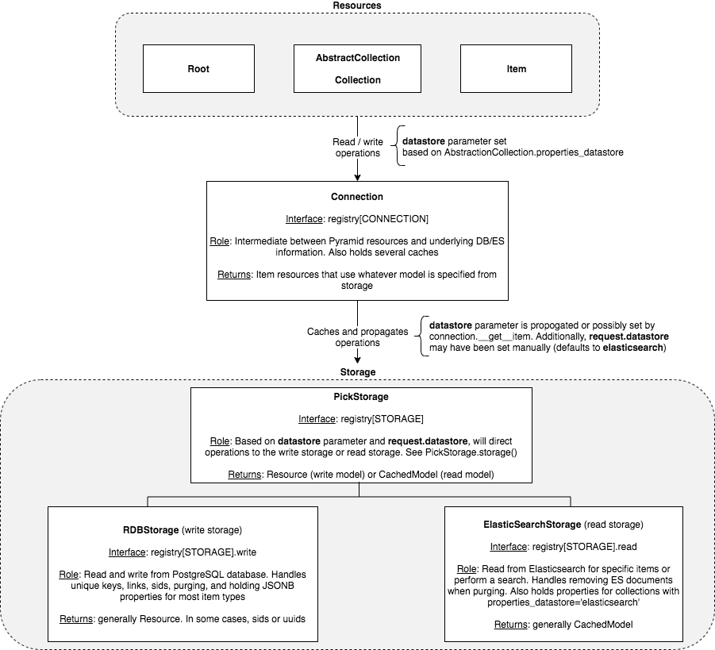

Storage Overview
=======================================

Figure 1: Overview of the storage classes. Emphasis is given to how read and write operations are directed to either the PostgreSQL or Elasticsearch storage interfaces.

Connection
-----------------
Snovault resources use the Connection class as an interface for reading and writing from PostgreSQL and Elasticsearch. Examples of resources include the base Root, AbstractCollection, and Item classes defined in src/snovault/resources.py. To get instances of an Item by unique key or some other value, the Storage class is leveraged through the Pyramid registry. An example of this is getting `registry[STORAGE].get_by_uuid( ... )` with an item uuid.

Many storage messages will have a `datastore` parameter that can be used to force using either the read (Elasticsearch) or write (PostgreSQL) storage classes. In the base item type, this is may be set for items that use `Item.used_datastore` to signify that the Item's properties are stored in Elasticsearch (more on this later). Usually the value of the `datastore` parameter is `None`.
