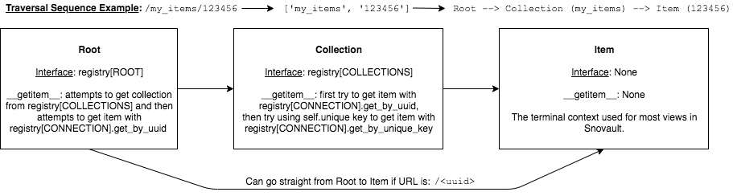

Traversal
===========================

**Work in progress!**

Background Information
------------------
`Pyramid traversal <https://docs.pylonsproject.org/projects/pyramid/en/latest/narr/traversal.html>`_. It may also be worth reading the `resource documentation <https://snovault.readthedocs.io/en/latest/resources.html>`_. The key piece is this: Pyramid traversal starts by acquiring the root resource by calling the root factory, which is set in the ``includeme`` in `config.py <https://github.com/4dn-dcic/snovault/blob/master/src/snovault/config.py>`_. Based off of the path sequence created from splitting the URL on ``/``, it will iteratively call ``__getitem__`` starting with the root until the terminal ``context`` resource is found.

For Snovault, the ``context`` for most views is the ``Item`` class. An example URL would be ``/<collection>/<uuid>``, which would start from the ``Root``, then get the ``Collection``, then finally get the ``Item`` needed for the view. ``/<uuid>`` also works, since the ``Root`` can look up item uuids directly. The view itself defines what ``context`` it uses, as well as things like request method and permissions. See the `resource views documentation <https://snovault.readthedocs.io/en/latest/resource_views.html>`_ for more info.

**Note:** you can easily override the ``__getitem__`` method of a resource to change how traversal works. An example is adding another field to ``AbstractCollection`` that is used to look up ``Item`` objects in the ``AbstractCollection.get`` method.

Figure 1: Diagram of the traversal project with a toy example. It describes how the ``__getitem__`` method is used at each resource to obtain to the next item in the traversal sequence.

**TODO: Add unique_key/name_key/lookup_key/uniqueKey info**
